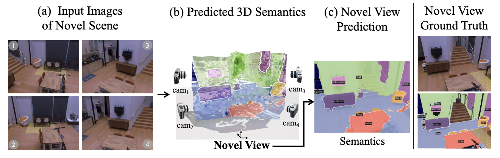

# Recognizing Scenes from Novel Viewpoints

Code release for our paper

**Recognizing Scenes from Novel Viewpoints**

[Shengyi Qian][sq], [Alexander Kirillov][ak], [Nikhila Ravi][nr], [Devendra Singh Chaplot][dsc], [Justin Johnson][jj], [David F. Fouhey][dff], [Georgia Gkioxari][gg]

[[`Project Page`](https://jasonqsy.github.io/viewseg/)]  [[`arXiv`](https://arxiv.org/abs/2112.01520)]  [[`BibTeX`](#citation)]




## Setup

The code is tested on pytorch 1.11.0, detectron2 0.6, and pytorch3d 0.6.2.

```bash
conda create -n viewseg python=3.8
conda activate viewseg

# install pytorch, pytorch3d and detectron2 
conda install pytorch torchvision torchaudio cudatoolkit=11.3 -c pytorch
conda install -c conda-forge -c fvcore -c iopath fvcore iopath
conda install pytorch3d -c pytorch3d
pip install 'git+https://github.com/facebookresearch/detectron2.git'

# install other packages
pip install accelerate==0.4.0
pip install submitit
pip install hydra-core --upgrade --pre
pip install hydra-submitit-launcher --upgrade
pip install visdom
pip install trimesh
pip install packaging plotly imageio imageio-ffmpeg matplotlib h5py opencv-contrib-python
```

Our checkpoints can be downloaded at [viewseg_checkpoints.tar.gz](https://drive.google.com/file/d/1nXpPbQ-DJMOrExPpQVTmYKtF5-TXdJOz/view?usp=sharing). Please put them under `checkpoints`. `deeplab_v3_ade20k` is the deeplabv3+ encoder pretrained on ade20k using detectron2. 

## Data Preprocessing

Our primary datasets are Hypersim and Replica. All datasets are put under `DEFAULT_DATA_ROOT` specfied [here](viewseg/dataset.py). 

For Hypersim, please refer to the original Hypersim [repo](https://github.com/apple/ml-hypersim) to download Hypersim dataset and put it under `viewseg_data/hypersim_renderings`. Our generated source/target pairs can be downloaded at [hypersim.tar.gz](https://drive.google.com/file/d/1_TIro62bYxUiImR7BmXbsSCOlDUzOcIn/view?usp=sharing). Optionally, we preprocess a detectron2-style `hypersim_sem_seg` dataset for semantic segmentation evaluation only at [hypersim_sem_seg.tar.gz](https://drive.google.com/file/d/1bqOZ8_gMdAsBoVqZaXa0-chvwg9zAwLb/view?usp=sharing).

For Replica, pre-processed data can be downloaded at [replica.tar.gz](https://drive.google.com/file/d/1leJmyZg3lThIzA3ZGOLsnzcnbA_xWxyD/view?usp=sharing). Optionally, we preprocess a detectron2-style `replica_sem_seg` dataset for semantic segmentation evaluation only at [replica_sem_seg.tar.gz](https://drive.google.com/file/d/1M_ZuoeTzcPby0YvpMJH-O08xS5l-I6ki/view?usp=sharing).

The final structure of the directory should look like

```
- viewseg_data
  - hypersim
  - hypersim_renderings
  - hypersim_sem_seg
  - replica
  - replica_sem_seg
```

## Test our pretrained model

```bash
# Render 2D rgb and semantic images
python test_viewseg.py --config-name=viewseg_replica_finetune test.mode='export_imgs' hydra/launcher=submitit_local data.render_size='[192, 256]'

# Generate 3D Visualizations
python test_viewseg.py --config-name=viewseg_replica_finetune test.mode='export_mesh' hydra/launcher=submitit_local data.render_size='[192, 256]'

# Generate video visualizations
python test_viewseg.py --config-name=viewseg_replica_finetune test.mode='export_video' hydra/launcher=submitit_local data.render_size='[192, 256]'
```

## Training 

We use `launcher.py` to launch training and evaluation on slurm-managed cluster. For example,

```bash
# train on hypersim
python launch.py --config viewseg_hypersim_source_4 --mode train --nodes 4 --gpus 8

# eval on hypersim
python launch.py --config viewseg_hypersim_source_4 --mode eval --gpus 8
python eval.py --config-name=viewseg_hypersim_source_4 test.mode='evaluation' test.split='val' hydra/launcher=submitit_local

# train on replica
python launch.py --config viewseg_replica_finetune --mode train --gpus 8

# eval on replica
python launch.py --config viewseg_replica_finetune --mode train --gpus 8
python eval.py --config-name=viewseg_replica_finetune test.mode='evaluation' test.split='val' hydra/launcher=submitit_local
```

However, if slurm is unavailable or you just want to train it on a single gpu, try

```bash
# training
python train_viewseg.py --config-name viewseg_replica_finetune hydra/launcher=submitit_local encoder.bn='FrozenBN'

# evaluation
python eval_viewseg.py --config-name viewseg_replica_finetune hydra/launcher=submitit_local encoder.bn='FrozenBN'
python eval.py --config-name=viewseg_replica_finetune test.mode='evaluation' test.split='val' hydra/launcher=submitit_local
```

`encoder.bn='FrozenBN'` changes the Deeplabv3+ encoder batch normalization layer from `SyncBN` to `FrozenBN`, since `SyncBN` has to be run with distributed training. It can also be set to `BN`. 

## License
The code is released under [CC-BY-NC 4.0](LICENSE.md).

## Citation

```
@article{qian2021recognizing,
  title={Recognizing Scenes from Novel Viewpoints},
  author={Qian, Shengyi and Kirillov, Alexander and Ravi, Nikhila and Chaplot, Devendra Singh and Johnson, Justin and Fouhey, David F and Gkioxari, Georgia},
  journal={arXiv preprint arXiv:2112.01520},
  year={2021}
}
```

[gg]: https://github.com/gkioxari
[jj]: https://github.com/jcjohnson
[nr]: https://github.com/nikhilaravi
[sq]: https://github.com/JasonQSY
[ak]: https://github.com/alexander-kirillov
[dsc]: https://github.com/devendrachaplot
[dff]: https://github.com/dfouhey

